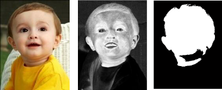

# Other possible solutions for facial region extraction:
1. Applying skin segmentation to isolate the cheek region from the rest of the image. This could involve color space transformations and thresholding.

2. Green channel signal extraction
    Can zero out the RB to be 0 and measure the intensity of the green plane(entirely CV2 based)

    (typically, the green channel is used for rPPG because it provides the best balance between melanin and hemoglobin absorption)

    After extraction of green signal information, it would require us to do spatial averaging(denoising) as well as bandpass filter application(denoising) for signal processing and signal analysis - DSP.