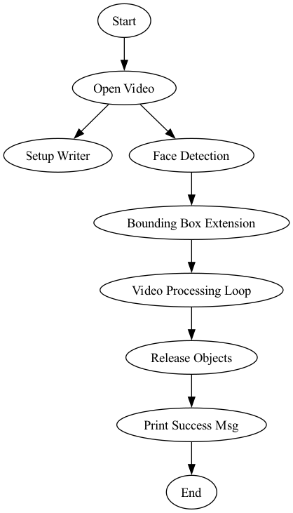

1. # Setup Video Capture and Writer:
    cv2.VideoCapture: Opens the input video file for reading.
    cv2.VideoWriter: Creates a video writer object for the output video with the specified format and properties.

2. # Face Detection and Bounding Box Extension:
    Uses Haar Cascade Classifier (face_cascade) to detect faces in the first frame.
    Extends the bounding box around the detected face and creates a mask (face_mask) representing the face region.

3. # Video Processing Loop:
    Iterates through each frame of the input video.
    Converts each frame to HSV color space.
    Applies a skin color range mask to isolate the skin pixels.
    Performs thresholding to obtain a binary mask.
    Applies morphological operations (closing and opening) to enhance the binary mask.
    Applies the static face mask to focus on the face region.
    Filters contours based on area to identify the skin region.
    Draws filled contours on a mask (contour_mask).
    Combines the filled contour mask with the original frame using bitwise AND.

4. # Release Video Capture and Writer:
    Releases the video capture and writer objects once the processing is complete.

5. # Print Success Message:
    Displays a message indicating the successful creation and saving of the output video.